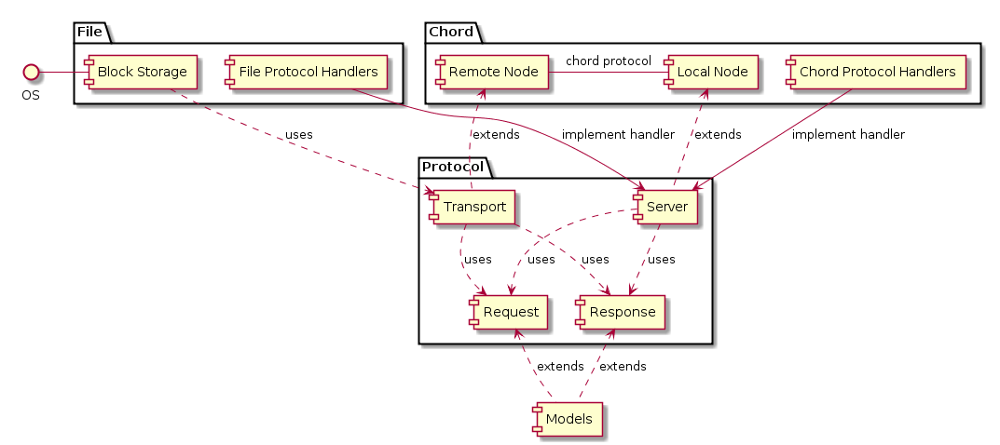

# PeerStore Design Document

## Introduction

Files are very important, and therefore must be stored in multiple locations.
What better way to protect files from a centralized failure than to put them
into a completely distributed system.  Moreover the performance benefits of
having documents sharded across a network, amoungst multiple nodes allows for
a better user experience.

### Purpose

PeerStore is a peer to peer file storage and sharing product.  As mentioned in
the [description of the project](../../README.md), the premise is to provide a
completely distributed secure peer to peer application for secure file storage
and sharing.  This application will in the end support the following features:

* File storage through a distributed hash table (DHT)
  * Implemented with the Chord algorithm
* Synchronization of files across client computers
* Authentication and Authorization of multiple users
* File Sharing across users
* Secure communications between peers in the DHT
* Strong Encryption of all files before they are inserted into DHT

### Scope

This design document will be broken into sections based completely on the four
primary milestones the project will be broken into, and thus will be designed
independently of the other milestones.  If a future milestone alters the design
in any way of a prior milestone, the design changes will be noted and explained
in that particular milestone's section of this document.

This document attempts to provide a journey, and not just the destination of
the project, and thus will be a living document.

#### Milestones

1. Develop DHT implementation and allow for storage of files
2. Ability to support multiple users and authentication
3. Synchronization of files between multiple clients
4. Encrypted file storage

### Definitions

*Peer* - a node participating in the network
*DHT* - Distributed Hash Table; a mechanism by which one can lookup which peer
in the PeerStore network is holding any given resource.
*Chord* - [The algorithm](../chord_sigcomm.pdf) used to accomplish a DHT in the
PeerStore network

### Structure of Milestone Documentation

Each milestone top level section will start with a brief description of what
the objectives are for that particular milestone.  Then there will be a sub
section outlining the Use Cases, and Component Architecture.  A Discussion will
then be outlined as a sub-section describing in great detail the specifications
of the implementation developed.  This will then be followed by the dependencies
that were used in the implementation, and why those dependancies were needed for
the implementation.

The final milestone sub-section will be an explaination of how to run and test
the implementation, which will prove the milestone objectives were
accomplished.

## Milestone 1 - DHT implementation and file storage

A few key objectives in this milestone are as follows:

 * Client/Server peer to peer communications
 * OS I/O abstraction for reading/writing files to disk
 * Insertion of files in correct nodes for DHT
 * Lookups in DHT for nodes containing files looked for

### Use Cases

There are a number of use cases that can be split into two independent modules
within the milestone.  These two are: the distributed hash table, used to find
relevent files amoungst the peers; the file sharing implementation.

We will start by talking only about the file sharing use cases at this time,
and will work through the details of the Chord use cases next.

As seen, the peer to peer file transmission only requires simple crud methods
for the server to implement, Post, Get and Delete.  From the client perspective
the application needs to accept a directory of files which it will register with
the client, so that each of the files within the directory are posted to the
peer servers.

### Component Architectures

The components created in this milestone are outlined below:

### Discussion (Specification)

###

### Dependencies

### Resources

 - [The Chord Algorithm](../chord_sigcomm.pdf)

